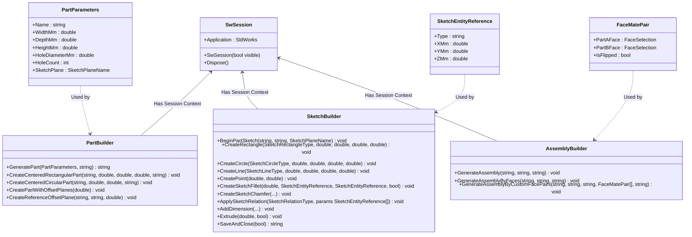

```mermaid
classDiagram
    class SwSession {
        +Application : SldWorks
        +SwSession(bool visible)
        +Dispose()
    }

    class PartParameters {
        +Name : string
        +WidthMm : double
        +DepthMm : double
        +HeightMm : double
        +HoleDiameterMm : double
        +HoleCount : int
        +SketchPlane : SketchPlaneName
    }

    class FaceMatePair {
        +PartAFace : FaceSelection
        +PartBFace : FaceSelection
        +IsFlipped : bool
    }

    class SketchEntityReference {
        +Type : string
        +XMm : double
        +YMm : double
        +ZMm : double
    }

    class PartBuilder {
        +GeneratePart(PartParameters, string) string
        +CreateCenteredRectangularPart(string, double, double, double, string) void
        +CreateCenteredCircularPart(string, double, double, string) void
        +CreatePartWithOffsetPlanes(double) void
        +CreateReferenceOffsetPlane(string, string, double) void
    }

    class SketchBuilder {
        +BeginPartSketch(string, string, SketchPlaneName) void
        +CreateRectangle(SketchRectangleType, double, double, double, double) void
        +CreateCircle(SketchCircleType, double, double, double, double) void
        +CreateLine(SketchLineType, double, double, double, double) void
        +CreatePoint(double, double) void
        +CreateSketchFillet(double, SketchEntityReference, SketchEntityReference, bool) void
        +CreateSketchChamfer(...) void
        +ApplySketchRelation(SketchRelationType, params SketchEntityReference[]) void
        +AddDimension(...) void
        +Extrude(double, bool) void
        +SaveAndClose(bool) string
    }

    class AssemblyBuilder {
        +GenerateAssembly(string, string, string) void
        +GenerateAssemblyByFaces(string, string, string) void
        +GenerateAssemblyByCustomFacePairs(string, string, string, FaceMatePair[], string) void
    }

    %% Relationships highlighting how Builders depend on SwSession and Data Models
    SwSession <-- PartBuilder : Has Session Context
    SwSession <-- SketchBuilder : Has Session Context
    SwSession <-- AssemblyBuilder : Has Session Context

    PartParameters ..> PartBuilder : Used by
    FaceMatePair ..> AssemblyBuilder : Used by
    SketchEntityReference ..> SketchBuilder : Used by
```
